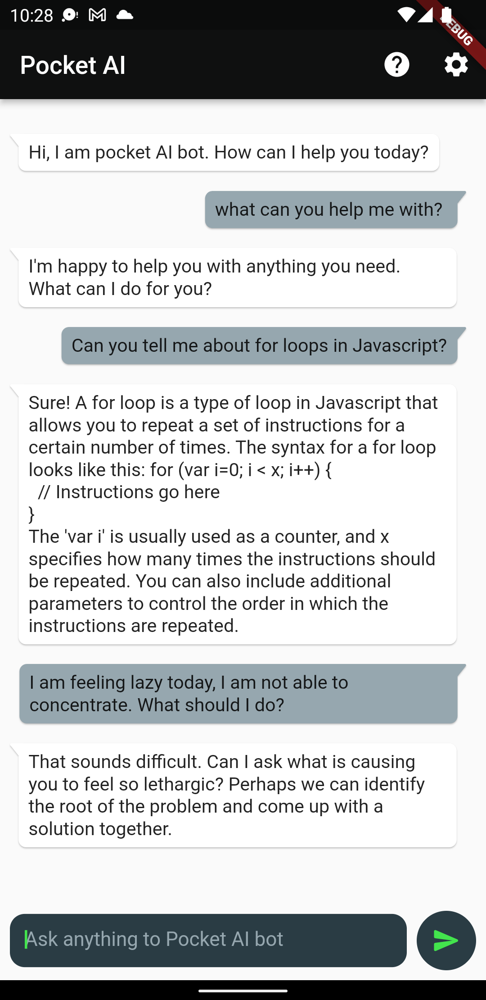
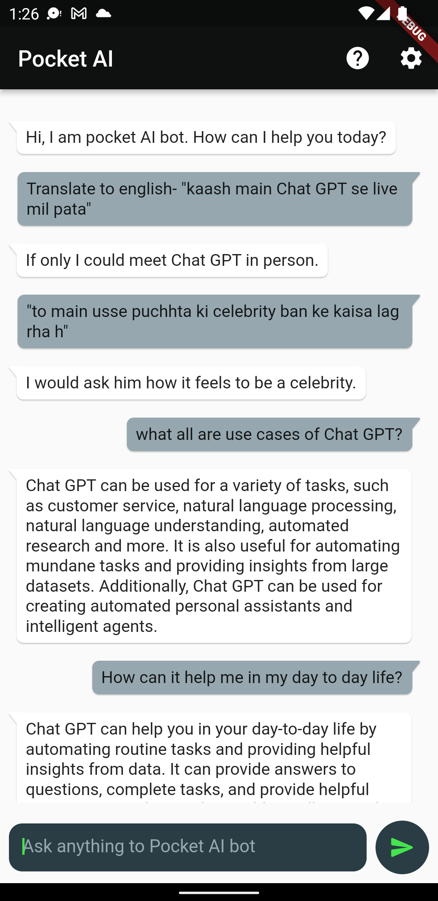
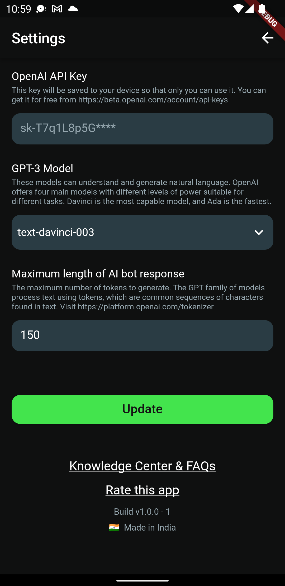

# pocket_ai

OpenAI GPT-3.5 powered free chatbot android app in Flutter similar to Chat-GPT

Download it from PlayStore: https://play.google.com/store/apps/details?id=me.varunon9.pocket_ai

## Features

1. Open-ended conversation with AI Chatbot powered by `gpt-3.5-turbo` model
2. Bot can respond to many queries e.g. Summarize content, translate to other languages, factual answers, draft emails, help in programming, etc
3. Bot remembers the last 2 sets of conversations so context is maintained while chatting
4. Users can generate content e.g. poems, quotes, thoughts etc using AI and share on social media
5. A settings screen to set the OpenAI API key, word limit, signature for generated content.
6. Copy chat messages functionality

## Screenshots
|  |  |
| --- | --- |
| | |
| | |

## Getting Started

This project is a starting point for a Flutter application.

A few resources to get you started if this is your first Flutter project:

- [Lab: Write your first Flutter app](https://docs.flutter.dev/get-started/codelab)
- [Cookbook: Useful Flutter samples](https://docs.flutter.dev/cookbook)

For help getting started with Flutter development, view the
[online documentation](https://docs.flutter.dev/), which offers tutorials,
samples, guidance on mobile development, and a full API reference.

## Useful commands

Flutter setup: https://docs.flutter.dev/get-started/install/macos

1. To create a new flutter app `flutter create my_app`
2. To check missing dependencies `flutter doctor -v`
3. List emulators `$ANDROID_HOME/emulator/emulator -list-avds`
4. Start an emulator `$ANDROID_HOME/emulator/emulator @1536_1024_device`
5. Check if devices are runnning `flutter devices`
6. Run app `flutter run`
7. To install any package `flutter pub add <package_name>` or `flutter pub add -d change_app_package_name`
8. Run in release mode `flutter run --release`
9. Build release apk `flutter build apk`
10. Generate upload key in android/app `keytool -genkey -v -keystore upload-keystore.jks -keyalg RSA -keysize 2048 -validity 10000 -alias upload -storetype JKS`
11. Check fingerprint `keytool -list -v -keystore ./android/app/upload-keystore.jks -alias upload`
12. Change package name `flutter pub add -d change_app_package_name` && `flutter pub run change_app_package_name:main me.varunon9.pocket_ai`
13. Update launcher icon `flutter pub add -d flutter_launcher_icons` && `flutter pub run flutter_launcher_icons:main`
14. Build releas bundle `flutter build appbundle`

## Documentation & Resources-

1. Update launcher icon: https://pub.dev/packages/flutter_launcher_icons
2. Integrate Firebase: https://firebase.google.com/docs/flutter/setup?platform=ios
3. Firebase Analytics: https://firebase.google.com/docs/analytics/get-started?platform=flutter
4. Firebase Crashlytics: https://firebase.google.com/docs/crashlytics/get-started?platform=flutter
5. Firebase Firestore: https://firebase.google.com/docs/firestore/quickstart#dart
6. Release android app: https://docs.flutter.dev/deployment/android
7. OpenAI API docs: https://platform.openai.com/docs/introduction/overview
8. Chat-GPT APIs: https://openai.com/blog/introducing-chatgpt-and-whisper-apis

## Use your own Firebase project

1. Login to firebase: `firebase login`
2. Select project: `flutterfire configure`

## How to get your Open AI API key

1. Signup https://beta.openai.com/signup
2. Visit https://beta.openai.com/account/api-keys and create free API key ($18 credit for 3 months)
3. Check API key usage: https://platform.openai.com/account/usage
4. Setup usage limits: https://platform.openai.com/account/billing/limits